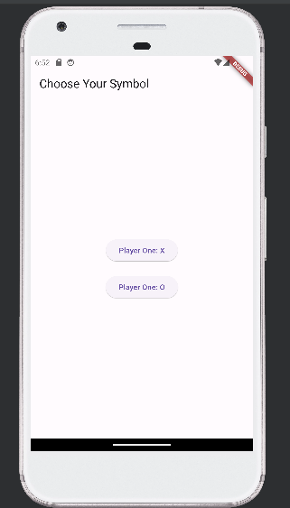
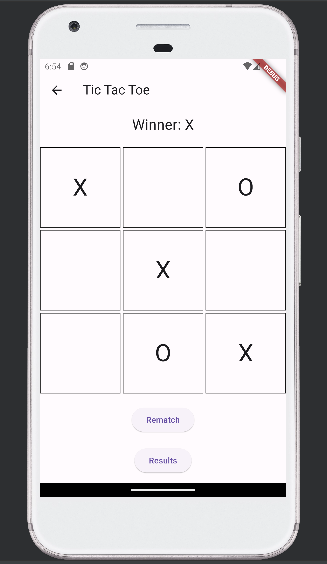
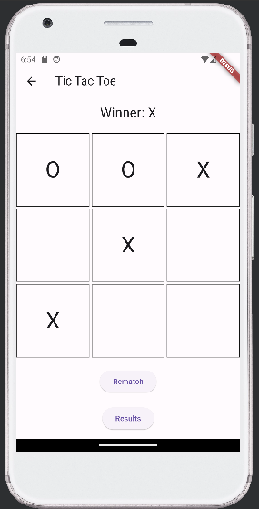
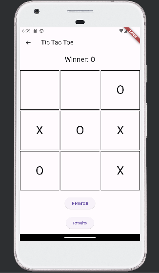
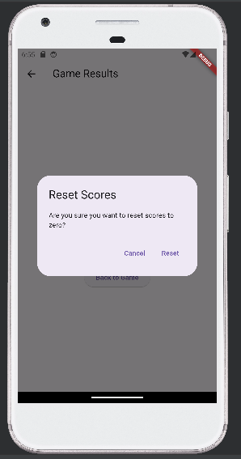
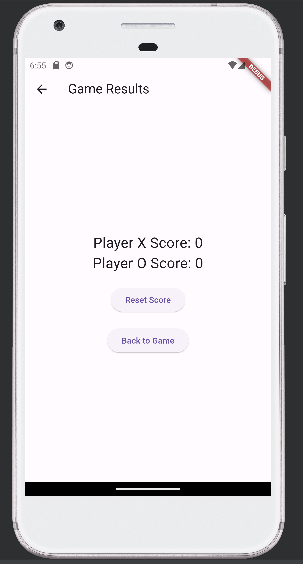

# Tic Tac Toe
A simple flutter application represtents tic tac toe game 

## Getting Started
starting our game in main class , which is implemented in the <a href="https://github.com/Menna-Islam/Tic-Tac-Toe/blob/master/lib/main.dart">main.dart</a> file.

Our program starts with a starting screen asking the user to choose their preferred symbol to start with:

## Lets play
After choosing the symbol , we will start the game 
for the sake of the game we will start with the X symbol and make it wins first two matches and then make the O symbol wins the third match 

This is the first match:

we have two options : 
- Rematch : which will take us to new match with respect to previous scores 
- Results : which will navigate us to the results page 

The second match:

Then , third match:

## Results
if we want to see the results we can do it by pressing the results button 
It will navigate us to the results screen 

Here , we will see that player X score is 2 and player O score is 1 as we played 

### Reset
we can go back to game panel or reset the scores 

if we chose the reset button , the application will show us a dialog box making sure if we want to reset the game scores 

if we press reset , it will reset the scores to zero and you can play new game as shown

