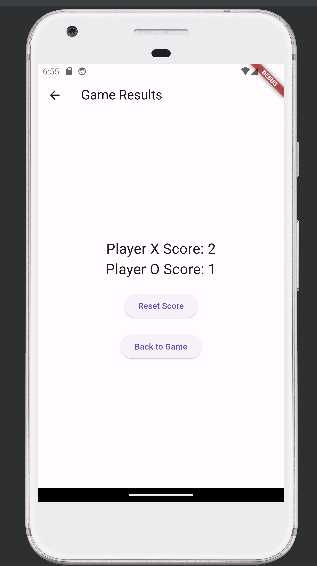

# Tic Tac Toe
A simple flutter application represtents tic tac toe game 

## Getting Started
The game starts in main class , which is implemented in the <a href="https://github.com/Menna-Islam/Tic-Tac-Toe/blob/master/lib/main.dart">main.dart</a> file.

Our program begins with a starting screen asking the user to choose their preferred symbol to start with:

## Lets play
After choosing the symbol, we start the game. 
For demonstration purposes, we'll start with the X symbol and show X winning the first two matches and O winning the third match.

In the first match, X wins:

We have two options:
- Rematch: Starts a new match while keeping the previous scores.
- Results: Navigates to the results page.
Here , we will choose to rematch

In the second match, X wins again:

In the third match, O wins:

## Results
To view the results, press the results button, which navigates to the results screen.

Here, we can see that player X's score is 2 and player O's score is 1:

### Reset
We can go back to the game panel or reset the scores.

If we choose the reset button, the application shows a dialog box to confirm if we want to reset the game scores:

If we press reset, it will reset the scores to zero, and we can start a new game:

Thank you for your time :)

## Team Members 

- Menna Islam 
- Mahmoud Shaaban 
- Adham Mamdouh 
- Ahmed Mohamed
